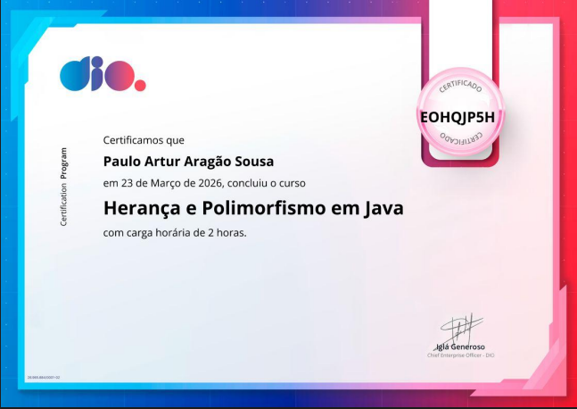

# 🏢 Employee Management System - POO em Java

Este projeto foi desenvolvido como parte dos meus estudos de **Programação Orientada a Objetos** na **UFERSA**. O objetivo principal é demonstrar a aplicação prática de conceitos avançados de Back-End em um cenário real de folha de pagamento corporativa.

## 🚀 Tecnologias e Conceitos
* **Linguagem:** Java 17
* **Conceitos de POO:** Herança, Polimorfismo, Classes Abstratas e Interfaces.
* **Organização:** Arquitetura limpa com separação de responsabilidades.

---

## 🎓 Aplicação Prática de Certificação

Este repositório consolida os conhecimentos teóricos obtidos na plataforma **DIO (Digital Innovation One)**, aplicando os pilares da programação orientada a objetos para criar um sistema escalável e eficiente.

### **Herança e Polimorfismo em Java**
* **Instituição:** DIO
* **Carga Horária:** 2 horas
* **Conclusão:** 23 de Março de 2026
* **ID de Verificação:** `EOHQJP5H`

<p align="center">
  
</p>

### 🛠️ O que implementei com foco em Back-End:
Neste projeto, utilizei os conceitos certificados para garantir a integridade dos dados e a flexibilidade do sistema:

1.  **Herança:** Estruturação de classes filhas (`Manager`, `Salesman`) que reutilizam atributos e comportamentos da classe pai, otimizando a manutenção do código.
2.  **Polimorfismo Dinâmico:** Implementação de uma lógica onde o cálculo de salário e bônus é processado de forma específica para cada tipo de funcionário em tempo de execução.
3.  **Abstração:** Uso de classes `abstract` para definir modelos de negócio que não devem ser instanciados diretamente, garantindo segurança na criação de objetos.
4.  **Interfaces:** Criação de contratos de comportamento (como autenticação) independentes da hierarquia principal de classes.

---

## 🛠️ Como rodar o projeto
1. Clone o repositório:
   ```bash
   git clone [https://github.com/pauloartur-dev/employee-management-system.git](https://github.com/pauloartur-dev/employee-management-system.git)
Abra a pasta raiz no VS Code.

Execute a classe Main.java localizada em src/.

Desenvolvido por Paulo Artur Aragão Sousa 👨‍💻